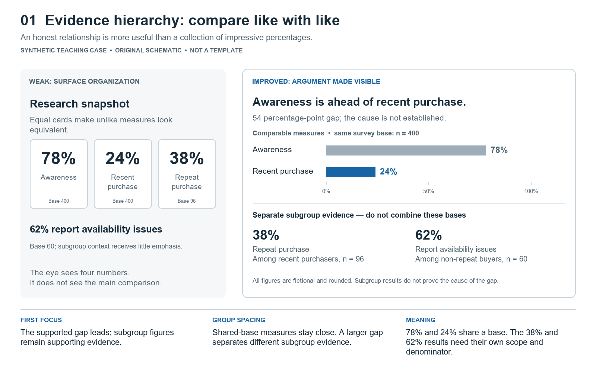
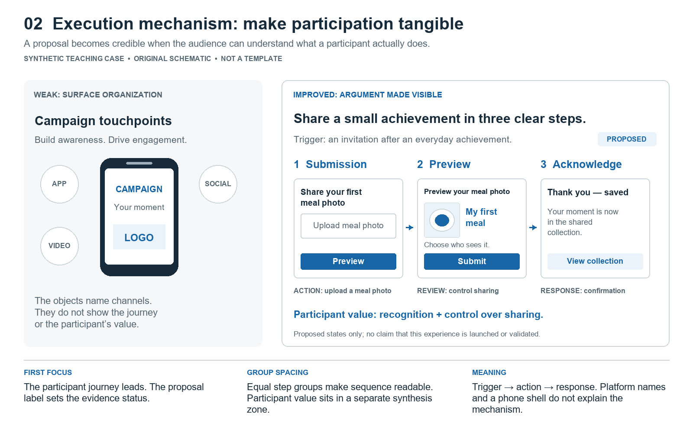
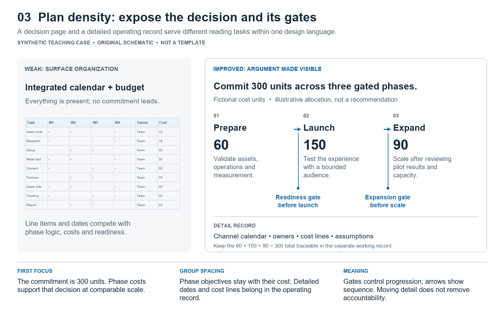

# Worked examples of the unified design judgment

These original teaching cases expand the specification's transfer exercises. All products, research, copy, numbers, timings, and creative ideas here are fictional. They are supplied facts within a case, not reusable evidence or recommendations for real clients. None reconstructs a reference slide. Different relationships remain within ONE design language.

The diagrams below are schematic explanations, not finished slide templates. Their colors, shapes, and proportions carry annotations for learning. Use the rationale, then compose afresh for the actual brief.

Unless a case says otherwise, assume a live 16:9 presentation, editable text and diagrams, and only authorized assets. The evidence example's percentages are rounded teaching inputs. Each case permits another composition if it preserves the supported claim, readable relationship, and qualifications; no case has one mandatory geometry.

## 1. Three metrics become one retention argument

**Teaching brief.** A fictional survey of 400 category buyers reports 78% aided awareness and 24% purchase in the past month. Among the 96 recent buyers, 38% report a second purchase within that month. Among the 60 recent buyers who did not repeat, 62% select inconvenient availability as one barrier. These are self-reports with different denominators, not stages of a tracked conversion funnel.

**Weak response.** Title the page “Consumer overview,” show 78%, 24%, and 38% in equally bright cards, add shopping icons, and claim “Availability causes lost retention.” This hides the question and overstates the evidence.

**Slide contract.** Question: where should we investigate friction? Takeaway: “Strong awareness coexists with limited recent purchase; non-repeat buyers report availability friction.” Evidence: all four scoped observations. Relationship: a comparable awareness/purchase contrast plus a qualified repeat-purchase observation. Focal object: the awareness/purchase contrast. Next step: test the availability hypothesis before changing the media allocation.

**Composition decision.** Put the two percentages with the same base on one shared scale. Give the repeat observation a clearly separate labeled evidence group. Attach the availability barrier to its subgroup, without an arrow that implies demonstrated cause. Keep methodological qualifications adjacent to their evidence. A chart and compact qualification zone should carry more weight than repeated containers.

**Hierarchy and omission.** The comparison receives the largest evidence area. Labels carry the metric definitions; subgroup evidence is subordinate but readable. Omit demographics unrelated to the availability question and put complete question wording in supporting notes. Retain sample bases on the page; do not omit them to make the chart look cleaner.

**Why it feels deliberate.** The eye sees a meaningful disparity rather than three celebrations. Scale makes comparable facts comparable, spacing separates different populations, and the headline describes what is known rather than manufacturing causality.

**Repair and acceptance.** At thumbnail size, the contrast should dominate. At reading size, the denominator change should be unmistakable. If viewers call it a funnel, remove connecting arrows and label the subgroup explicitly. If they infer a causal result, weaken the headline and show the proposed test as a hypothesis.

**Constraint change.** If the metrics refer to different periods, they no longer deserve an unqualified same-base comparison. Put the period in the labels, revise the takeaway, or show separate observations. Never preserve the attractive geometry after its factual premise disappears.

## 2. Audience tension becomes a credible product role

**Teaching brief.** Eight fictional interviews with commuters suggest a desire for a calmer morning and reluctance to add another preparation task. A fictional breakfast product has a verified ready-to-eat format. There is no evidence of improved health, mood, or productivity.

**Weak response.** Pair “Busy professionals aged 25–40” with a generic smiling portrait and the promise “A happier, healthier morning.” The portrait supplies no relevant behavior and the promise exceeds the product evidence.

**Slide contract.** Question: what need can this product credibly serve? Takeaway: “Make breakfast available without adding a preparation step.” Evidence: exploratory interview theme plus ready-to-eat format. Relationship: desire -> barrier -> credible response. Focal object: the desire/barrier tension. Next step: explore a friction-reduction proposition with broader validation.

**Composition decision.** Use a real or authorized illustrative routine scene only if it shows the relevant time pressure. Preserve the gesture, task, and context in the crop. Place the concise tension in a quiet region and connect the product format to the preparation barrier. Avoid a face competing with the core phrase. If no relevant photo exists, typography and a short relationship diagram are sufficient.

**Hierarchy and omission.** Give the tension a clear headline voice. Keep the product's verified capability near its role, with an exploratory-research label. Omit unsupported demographic generalizations and every unverified benefit. The product need not dominate until the audience understands why it matters.

**Why it feels deliberate.** The image supplies a situation, the type supplies interpretation, and the product supplies a bounded response. This is a marketing argument with an emotional context, rather than emotion standing in for evidence.

**Repair and acceptance.** A viewer should distinguish the observed interview theme from the proposed proposition. Remove any implied clinical or performance outcome. If the photo cannot explain the tension without a paragraph, reconsider the selection or crop.

**Constraint change.** In a purchaser/user scenario, put the tension with the right person. A parent's purchase concern and a child's usage preference may require a comparison or separate argument; do not imply that one interview source represents both.

## 3. A product feature becomes visible proof

**Teaching brief.** A fictional reusable container has a verified single-hand opening mechanism. The audience is considering whether the mechanism reduces handling steps in a specific use situation. No comparative test proves it is faster than a competitor.

**Weak response.** Float a small packshot beside six generic benefit icons and the headline “The ultimate convenience solution.”

**Slide contract.** Question: what exactly makes the handling simpler? Takeaway: “The opening mechanism can be operated with one hand.” Evidence: a documented mechanism demonstration. Relationship: object -> action -> observable feature. Focal object: the mechanism in use. Next step: assess whether this capability matters in the intended context.

**Composition decision.** Use a dominant contextual close-up or a short sequence that preserves the hand, control, and relevant motion. If the mechanism is too small in a full packshot, enlarge a detail beside the whole object. Keep callout lines short, directional, and attached to the actual feature. Do not use decorative arrows to suggest unobserved performance.

**Hierarchy and omission.** Give the demonstration more room than the claim. Use one precise feature label and one contextual sentence. Omit unrelated materials, flavors, or lifestyle copy unless the decision needs them. Maintain clean cutout edges and plausible grounding when a cutout is used.

**Why it feels deliberate.** The visual makes the claim inspectable. Scale follows the size of the feature the audience must understand. Fewer labels give the mechanism room rather than making the page artificially minimal.

**Repair and acceptance.** The control and action must remain legible at presentation size. If an arrow or cropped hand hides the evidence, replace it. If the audience cannot see the capability, the page has a proof problem that another slogan cannot solve.

**Constraint change.** Without demonstration assets, describe the verified mechanism and flag the missing evidence. Use a labeled explanatory illustration only when permitted and mark it illustrative. Do not invent a photorealistic test result.

## 4. A campaign reveal earns its visual intensity

**Teaching brief.** A fictional campaign invites first-time home cooks to share a modest completed meal. The preceding research supports anxiety about making a perfect-looking result; the campaign proposition is to lower the participation threshold. “Small meals count” is invented teaching copy.

**Weak response.** Add a giant slogan, five social platform logos, multiple lifestyle photos, and a content calendar to one reveal page.

**Slide contract.** Question: what is the memorable invitation? Takeaway: the campaign values an achievable first attempt. Relationship: a simple verbal invitation embodied by one believable moment. Focal object: campaign phrase with a meaningful image. Next step: understand how the invitation becomes a participation flow.

**Composition decision.** Give the short expression display-scale type and one image of the relevant achievement. Preserve a quiet text region; do not cover the meal or expressive gesture with copy. Keep the same type roles and color meanings as the analytical pages; larger scale and lower density provide the change in energy.

**Hierarchy and omission.** Show the invitation first, then a short explanation if the phrase needs it. Move submission details, channel roles, and success measures to the pages that answer those questions. A reveal is incomplete across a deck without those pages, but it need not contain them all.

**Why it feels deliberate.** The emotional peak comes from a specific audience tension already established. Empty space protects a memorable phrase rather than concealing a weak idea. Its expressive force remains connected to the strategy.

**Repair and acceptance.** Read the headline sequence before this page. If the reveal could follow any research with no change, strengthen the causal link. If the picture looks aspirationally perfect and contradicts the modest invitation, choose a more credible image.

**Constraint change.** If the phrase is long in Vietnamese, rewrite it with the user's approval when meaning or brand copy requires approval; otherwise choose a less expansive composition. Do not split accents, scatter words, or shrink a long phrase into ordinary body text while calling it a reveal.

## 5. Campaign execution becomes an inspectable mechanism

**Teaching brief.** Extend the preceding fictional campaign: a visitor opens a landing page, uploads one photo, previews a caption, then receives a shareable acknowledgement. Partners and production are unconfirmed.

**Weak response.** Decorate the page with a phone frame, a creator headshot, and “Drive engagement.” The audience cannot tell what happens or who benefits.

**Slide contract.** Question: what would a participant actually do? Takeaway: “A proposed submission path aims to make the first attempt easy to share.” Evidence: proposed interaction states, not live performance or tested usability. Relationship: trigger -> action -> response. Focal object: the path through the relevant states. Next step: approve a prototype test, with assumptions still visible.

**Composition decision.** Show the three necessary states at a readable scale: submission, preview, acknowledgement. Label the action beside each state, keep equal-stage frame treatment, and use arrows only for the actual progression. A phone shell is optional; if it makes interface text too small, use a focused screen crop. Put the value to the participant near the response state.

**Hierarchy and omission.** The sequence leads; short actions guide the reading path. Keep “Proposed prototype” visible and identify critical unresolved dependencies. Move the complete social content plan elsewhere. Omit fictional creator commitments and platform logos that do not explain a role.

**Why it feels deliberate.** Artifacts and labels let the audience imagine the behavior. The page carries enough specificity to review feasibility without presenting proposed work as deployed work.

**Repair and acceptance.** Ask a reviewer to narrate trigger, action, response, and value without reading a paragraph. If they cannot, repair missing states or weak labels. Check that every drawn button and response has a plausible role in the proposal.

**Constraint change.** If legal or operational review adds a consent step, update the mechanism and friction assumption. Do not hide a material step merely to preserve a three-stage drawing.

## 6. A comparison becomes a fair decision

**Teaching brief.** A fictional team compares a retail trial, a creator series, and a landing-page test. Supplied estimates cover cost, speed to learn, operational effort, and the question each activity can answer. Estimates are uncertain; none has demonstrated sales uplift.

The illustrative cost cap is 120 units. The immediate question is which message attracts the intended audience to request more information. These fictional planning inputs assume an existing web page and working analytics; the time estimates include setup and collection. They are not observed performance or universal channel benchmarks.

| Option | Estimated cost, illustrative units | Estimated days to first interpretable signal | Estimated staff-days | Question it can help answer |
|---|---:|---:|---:|---|
| Retail trial | 180 | 21 | 6 | What happens when people physically try the product? |
| Creator series | 110 | 14 | 4 | How does a message perform in the selected creator's context? |
| Landing-page test | 80 | 7 | 2 | Which tested message receives more qualified information requests? |

Audience comparability, test allocation, and sufficient observations still require a test plan. This table supports a bounded planning choice; it does not prove that the chosen option will deliver valid learning or sales.

**Weak response.** Present three cards with inconsistent criteria, extra detail for the favored option, and a green badge saying “Best ROI.”

**Slide contract.** Question: which pilot best answers the immediate uncertainty? Takeaway: “The landing-page test offers the quickest learnings on message response within the current cap.” Evidence: comparable supplied estimates and a clearly stated decision criterion. Relationship: equal-criteria comparison -> bounded recommendation. Focal object: the decision-relevant row or column. Next step: approve the selected test or challenge its assumptions.

**Composition decision.** Use a table with the same criteria and comparable wording for each option. Align units and numeric columns. Highlight the selected option with one semantic accent while retaining legibility and visibility of disadvantages. Position the recommendation beside or below the comparison rather than using a large badge that replaces the evidence.

**Hierarchy and omission.** Make the governing criterion prominent; keep uncertainty beside estimates. Omit decorative portraits and unsupported ROI language. Retain any constraint that could reverse the decision, such as analytics setup time or recruitment requirements.

**Why it feels deliberate.** The audience can audit the choice. Equal treatment communicates trust; selective emphasis communicates a recommendation rather than a claim of universal superiority.

**Repair and acceptance.** Remove the highlight: the recommendation should still be defensible from the table. Check missing entries, asymmetric copy length, different units, and unmentioned counterevidence. Reword “best” claims to the actual decision context.

**Constraint change.** If the priority becomes physical product trial, the preferred option may change. Keep the comparison grammar and recompute the judgment; never preserve the favored column by habit.

## 7. An operating plan becomes an approval page

**Teaching brief.** A fictional plan has a cost cap of 300 illustrative units, three phases costing 60, 150, and 90 units, ten channels, and twenty task lines. Readiness review gates precede launch; a later gate determines whether to expand. Counts and cost units are teaching inputs only.

**Weak response.** Shrink the complete calendar, budget table, and channel list until all fit on one page. The total is large, but the commitment and dependencies are invisible.

**Slide contract.** Question: what are we approving, and when can we reconsider? Takeaway: “Commit the pilot in stages, with readiness and expansion gates.” Evidence: supplied stages, owners, dependencies, and reconciled costs. Relationship: sequence with conditional gates plus allocation. Focal object: the gated phase plan. Next step: approve the initial commitment and accountability.

**Composition decision.** Give each phase comparable structure: outcome, owner, cost, timing, and exit condition. Put gates on the relevant boundaries and distinguish a scheduled activity from a condition-dependent next step. A compact budget summary can sit beside the plan if it remains readable; otherwise separate it. Keep the 60 + 150 + 90 = 300 reconciliation traceable.

**Hierarchy and omission.** Highlight the present approval and total exposure. Move the twenty task lines and per-channel calendar into a readable appendix; point to that detail. Do not move the conditions that determine commitment out of view.

**Why it feels deliberate.** Density follows the decision. The page reveals responsibility and conditions rather than proving completeness by packing in more text.

**Repair and acceptance.** At presentation size, reviewers should identify the current commitment, first gate, owner, and total without inspecting microtext. Verify the appendix still contains the omitted detail and agrees with the summary.

**Constraint change.** A fixed page limit may require a separate detail document. Preserve critical gates and qualification on the decision page; reducing font size is the last response, not the first.

## 8. A closing page converts the story into a bounded ask

**Teaching brief.** A fictional director must approve a proposed six-week pilot with an identified owner, a defined cap, and a review date. Results are not yet known.

**Weak response.** End with “Thank you” and a large slogan, leaving the audience to infer the decision.

**Slide contract.** Question: what decision should be made now? Takeaway: approve the pilot under the stated conditions. Evidence: a compact reminder of the supported opportunity and feasible plan. Relationship: recommendation -> commitment -> next review. Focal object: the approval ask. Next step: record approval or the remaining condition.

**Composition decision.** Use one clear request, with concise cap, timing, owner, and review condition beneath it. Echo the opening's relevant subject or promise through scale or imagery where useful. Keep administrative details aligned and subordinate. If a material uncertainty remains, put its resolution condition near the ask.

**Why it feels deliberate.** The ending preserves confidence while making the consequence concrete. It does not let visual polish conceal an ambiguous request or present a proposed outcome as guaranteed.

**Repair and acceptance.** A viewer should restate the decision in one sentence and name the next responsible action. If they cannot, rewrite the ask before changing the layout.

## Rhythm across these relationships

A plausible narrative might move from a scoped evidence page, to a quieter synthesis of the human tension, to product proof, to a sparse creative reveal, to tangible execution, then comparison, commitment, and ask. This is a teaching sequence, not a mandatory deck outline. A performance report may start with outcomes; a short approval request may omit a creative reveal entirely.

The constant is the semantic grammar: strong entry point, readable evidence, consistent type roles, spacing that expresses groups, restrained emphasis, honest qualifications, and a question answered by the following page. The change is how much visual weight each argument needs.

## The example has transferred when it can be changed

For any new brief, write three sentences before copying an arrangement:

1. “This relationship fits because the audience must understand …”
2. “The dominant object is … because it carries …”
3. “I deliberately leave out … while retaining … because the decision requires …”

Then change a material constraint and revise the answer. Precise explanations plus a legible rendering are evidence of transfer. Familiar-looking geometry alone is not.
